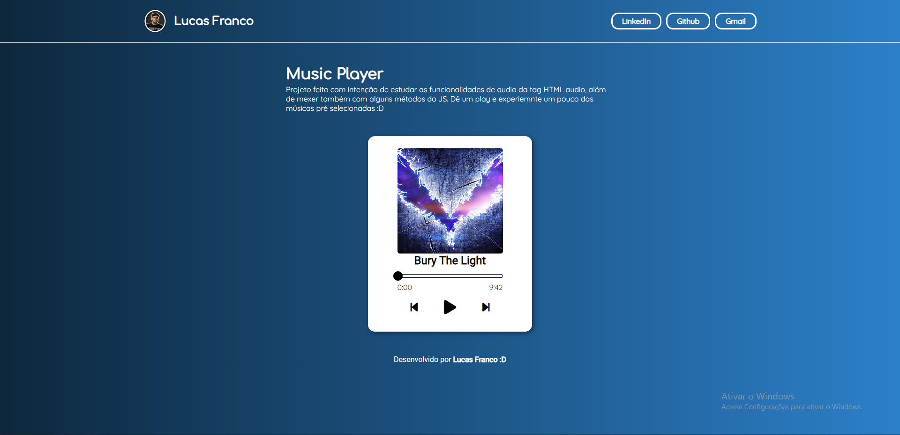
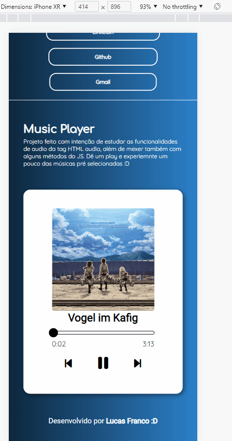
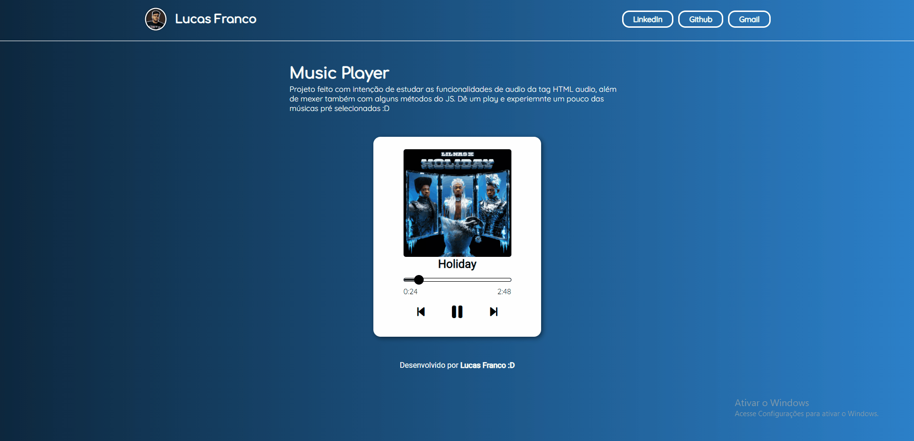

<h1>Verificador de Idade</h1>

<!-- LINKS -->

 
 <h2> Sumário</h2>
 
 <a href="#fotos">Fotos</a> - 
  <a href="#GIFs">GIFs</a> - 
  <a href="#sobre">Sobre o Projeto</a> - 
  <a href="#tec">Tecnologias</a>

 

<!-- FOTOS -->

    <h2> 📸 Fotos </h2>
        
          
       
 <h2> 📱 Responsivo </h2>
    
          
        
   <h2 id="GIFs"> 🎥 GIFs </h2>
        
          

<!-- SOBRE -->

    <h2> 📝 Sobre o Projeto </h2> 
    
 Esse projeto é somente um player de música padrão onde ele <strong> toca </strong> uma das músicas selecionadas, <strong>pula </strong> para a próxima,<strong> retrocede </strong> e tem uma barra que aparece o tempo, além do  <strong> tempo atual </strong> da música e qual é o <strong> tempo total </strong> da música.

 
 <h3 align="center">Link do Projeto <a href="https://lucasfrancobn.github.io/Verificador-de-Idade/">CLIQUE AQUI</a></h3>

<h3> ATENÇÃO: O autor deste projeto não tem os direitos autorais das músicas, o projeto foi jeito apenas para o estudos das tecnologias utilizadas nesse projeto. </h3>

 

<!-- TECNOLOGIAS -->

<h2> 🖥️ Tecnologias</h2>
    
 ✔️ HTML 5 

    
 ✔️ CSS 3 

    
 ✔️ JavaScript 

